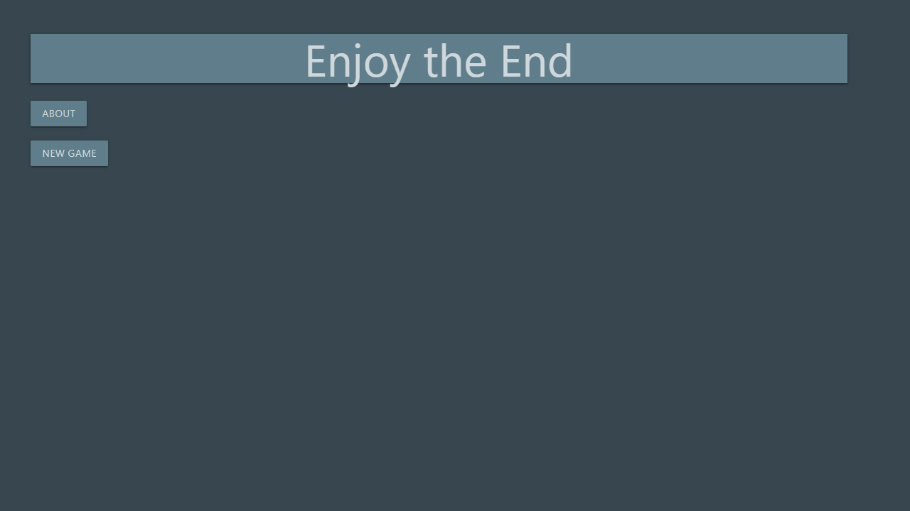

# ETE

This is my entry in [Phoenix Phrenzy](https://phoenixphrenzy.com), showing off what [Phoenix](https://phoenixframework.org/) and [LiveView](https://github.com/phoenixframework/phoenix_live_view) can do.

## About
ETE utilizes the canvas element (for better or for worse) to render a simple little game
I created centered around most of the animals in my life. The name ETE, or Enjoy the End,
is based loosely off of a concept from a manga I read called *Gigant*.

In *Gigant* there is an app available to everyone that can be used to vote on outlandish
things that will happen in the real world. The events are usually sinister in nature, playing on the
idea that humans are actually cruel beings who want to watch the world burn.

# Attributions
All pictures of the kittens were taken by me and edited by Andris#2694 on Discord.

The vector of the mouse is part of the public domain. It was found [here](https://publicdomainvectors.org/en/free-clipart/Vector-drawing-of-mouse-with-pink-ears/22307.html) on publicdomainvectors.org which is located [here](https://publicdomainvectors.org/).

## Resources
[This](http://www.petecorey.com/blog/2019/09/02/animating-a-canvas-with-phoenix-liveview/) blog post by Pete Corey for setting up JS interop.

[Materialize](https://materializecss.com/) for styling.

## Learn more

  * Official website: http://www.phoenixframework.org/
  * Guides: https://hexdocs.pm/phoenix/overview.html
  * Docs: https://hexdocs.pm/phoenix
  * Mailing list: http://groups.google.com/group/phoenix-talk
  * Source: https://github.com/phoenixframework/phoenix
